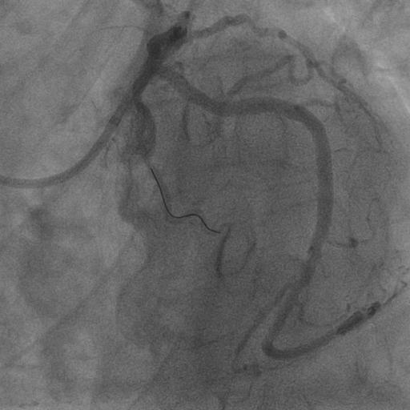
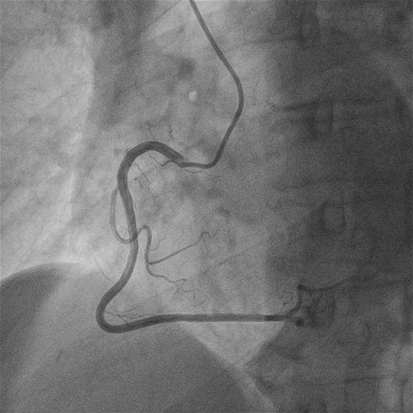
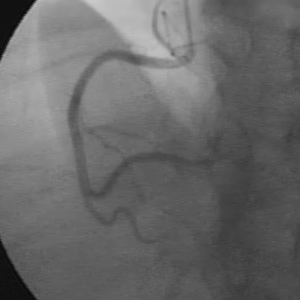

# TFM_VascularSegmentation_StenosisDetection
TFM VIU Catagua Cobos Josseph Yaakob


## Datasets

### ARCADE

Recuperado en [KAGGLE - ARCADE](https://www.kaggle.com/datasets/gongiahmed/arcade-x-ray-angiography-images) con imágenes de angiografía y sus respectivas anotaciones al estilo COCO para la segmentación vascular y detección de estenosis.

<table>
  <tr>
    <td align="center">
      
      <br>
      Imagen 1. ARCADE-Estenosis
    </td>
    <td align="center">
      
      <br>
      Imagen 2. ARCADE-Sintaxis
    </td>
  </tr>
</table>

```plaintext
📂 **ARCADE**
│── 📂 **stenosis**
│   ├── 📄 data.yaml
│   ├── 📂 **test**
│   │   ├── 📄 labels.cache
│   │   ├── 📂 annotations (1) → test.json
│   │   ├── 📂 images (300) → _Ejemplos_: 1.png, 10.png, 100.png...
│   │   └── 📂 labels (300) → _Ejemplos_: 1.txt, 10.txt, 100.txt...
│   ├── 📂 **train**
│   │   ├── 📄 labels.cache
│   │   ├── 📂 annotations (1) → train.json
│   │   ├── 📂 images (1000) → _Ejemplos_: 1.png, 10.png, 100.png...
│   │   └── 📂 labels (997) → _Ejemplos_: 1.txt, 10.txt, 100.txt...
│   └── 📂 **val**
│       ├── 📄 labels.cache
│       ├── 📂 annotations (1) → val.json
│       ├── 📂 images (200) → _Ejemplos_: 1.png, 10.png, 100.png...
│       └── 📂 labels (200) → _Ejemplos_: 1.txt, 10.txt, 100.txt...
│
│── 📂 **syntax**
    ├── 📄 data.yaml
    ├── 📂 **test**
    │   ├── 📄 labels.cache
    │   ├── 📂 annotations (1) → test.json
    │   ├── 📂 images (300) → _Ejemplos_: 1.png, 10.png, 100.png...
    │   └── 📂 labels (300) → _Ejemplos_: 1.txt, 10.txt, 100.txt...
    ├── 📂 **train**
    │   ├── 📄 labels.cache
    │   ├── 📂 annotations (1) → train.json
    │   ├── 📂 images (1000) → _Ejemplos_: 1.png, 10.png, 100.png...
    │   └── 📂 labels (1000) → _Ejemplos_: 1.txt, 10.txt, 100.txt...
    └── 📂 **val**
        ├── 📄 labels.cache
        ├── 📂 annotations (1) → val.json
        ├── 📂 images (200) → _Ejemplos_: 1.png, 10.png, 100.png...
        └── 📂 labels (200) → _Ejemplos_: 1.txt, 10.txt, 100.txt...
```

### Database X-ray Coronary Angiograms

Recuperado en [KAGGLE - DCA1](https://www.kaggle.com/datasets/bard2024/database-x-ray-coronary-angiograms-dca1?select=Database_134_Angiograms) con imágenes de angiografía y sus respectivas máscaras de segmentación.

<table>
  <tr>
    <td align="center">
      
      <br>
      Imagen 3. DCA1-Angiografía
    </td>
    <td align="center">
      
      <br>
      Imagen 4. DCA1-Máscara
    </td>
  </tr>
</table>

```plaintext
📂 **DCA1**
└── Archivos (268): _Ejemplos_: 1.pgm, 10.pgm, 100.pgm, 100_gt.pgm, 101.pgm
```

##