# **TFM_VascularSegmentation_StenosisDetection**
**TFM VIU Catagua Cobos Josseph Yaakob**


## **DATASETS**

### ARCADE

Recuperado en [KAGGLE - ARCADE](https://www.kaggle.com/datasets/gongiahmed/arcade-x-ray-angiography-images) con imágenes de angiografía y sus respectivas anotaciones al estilo COCO para la segmentación vascular y detección de estenosis.

<table>
  <tr>
    <td align="center">
      
      <br>
      Imagen 1. ARCADE-Estenosis
    </td>
    <td align="center">
      
      <br>
      Imagen 2. ARCADE-Sintaxis
    </td>
  </tr>
</table>

```plaintext
📂 ARCADE
│── 📂 stenosis
│   ├── 📄 data.yaml
│   ├── 📂 test
│   │   ├── 📄 labels.cache
│   │   ├── 📂 annotations (1) → test.json
│   │   ├── 📂 images (300) → _Ejemplos_: 1.png, 10.png, 100.png...
│   │   └── 📂 labels (300) → _Ejemplos_: 1.txt, 10.txt, 100.txt...
│   ├── 📂 train
│   │   ├── 📄 labels.cache
│   │   ├── 📂 annotations (1) → train.json
│   │   ├── 📂 images (1000) → _Ejemplos_: 1.png, 10.png, 100.png...
│   │   └── 📂 labels (997) → _Ejemplos_: 1.txt, 10.txt, 100.txt...
│   └── 📂 val
│       ├── 📄 labels.cache
│       ├── 📂 annotations (1) → val.json
│       ├── 📂 images (200) → _Ejemplos_: 1.png, 10.png, 100.png...
│       └── 📂 labels (200) → _Ejemplos_: 1.txt, 10.txt, 100.txt...
│
│── 📂 syntax
    ├── 📄 data.yaml
    ├── 📂 test
    │   ├── 📄 labels.cache
    │   ├── 📂 annotations (1) → test.json
    │   ├── 📂 images (300) → _Ejemplos_: 1.png, 10.png, 100.png...
    │   └── 📂 labels (300) → _Ejemplos_: 1.txt, 10.txt, 100.txt...
    ├── 📂 train
    │   ├── 📄 labels.cache
    │   ├── 📂 annotations (1) → train.json
    │   ├── 📂 images (1000) → _Ejemplos_: 1.png, 10.png, 100.png...
    │   └── 📂 labels (1000) → _Ejemplos_: 1.txt, 10.txt, 100.txt...
    └── 📂 val
        ├── 📄 labels.cache
        ├── 📂 annotations (1) → val.json
        ├── 📂 images (200) → _Ejemplos_: 1.png, 10.png, 100.png...
        └── 📂 labels (200) → _Ejemplos_: 1.txt, 10.txt, 100.txt...
```

### Database X-ray Coronary Angiograms

Recuperado en [KAGGLE - DCA1](https://www.kaggle.com/datasets/bard2024/database-x-ray-coronary-angiograms-dca1?select=Database_134_Angiograms) con imágenes de angiografía y sus respectivas máscaras de segmentación.

<table>
  <tr>
    <td align="center">
      
      <br>
      Imagen 3. DCA1-Angiografía
    </td>
    <td align="center">
      
      <br>
      Imagen 4. DCA1-Máscara
    </td>
  </tr>
</table>

```plaintext
📂 DCA1
└── Archivos (268): _Ejemplos_: 1.pgm, 10.pgm, 100.pgm, 100_gt.pgm, 101.pgm
```

## **GENERACIÓN DE DATOS**

Se usaron las anotaciones del dataset ARCADE para generar las máscaras de segmentación:

<table>
  <tr>
    <td align="center">
      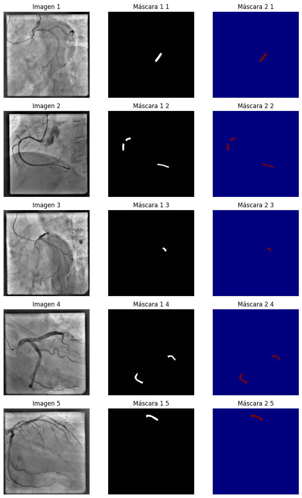
      <br>
      Imagen 5. ARCADE-Stenosis-Generación de máscaras
    </td>
    <td align="center">
      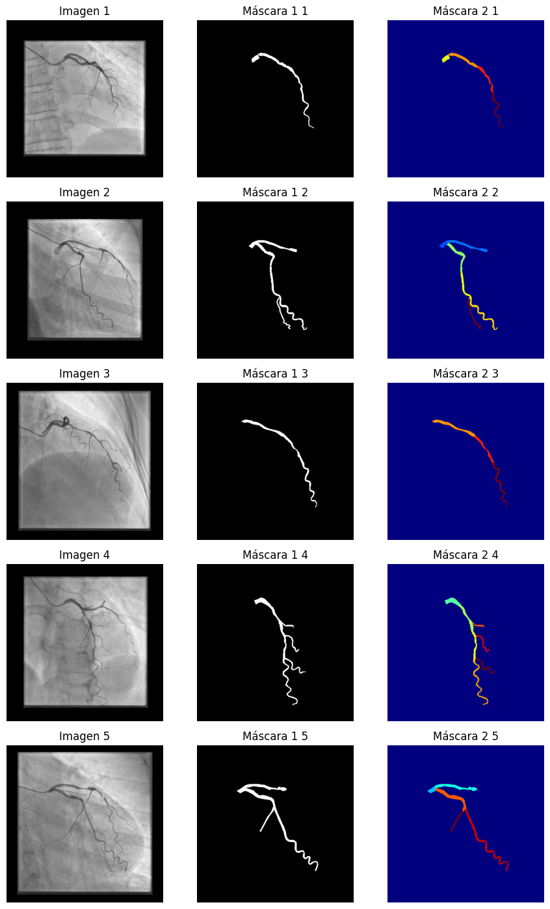
      <br>
      Imagen 6. ARCADE-Syntax-Generación de máscaras
    </td>
  </tr>
</table>

## **ESTUDIO DE PREPROCESAMIENTO**

Se aplicaron varios filtros de imagen, para observar cuál influye más en la segmentación vascular y la detección de estenosis:

<table>
  <tr>
    <td align="center">
      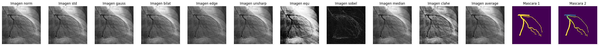
      <br>
      Imagen 7. ARCADE-Segmentación-Filtros aplicados
    </td>
  </tr>
  <tr>
    <td align="center">
      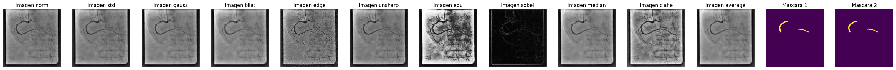
      <br>
      Imagen 8. ARCADE-Detección-Filtros aplicados
    </td>
  </tr>
</table>

Luego se aplicó un estudio por matriz de correlación con un umbral de 0.9 o 90% máximo de correlación entre filtros:

<table>
  <tr>
    <td align="center">
        Matriz de correlación
    </td>
    <td align="center">
        Filtros descartados
    </td>
    <td align="center">
        Filtros no descartados
    </td>
  </tr>
  <tr>
    <td align="center">
      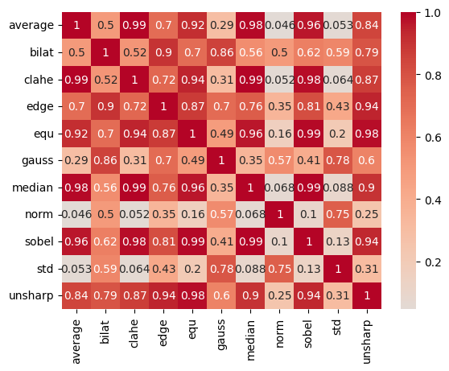
      <br>
      Imagen 9. ARCADE-Segmentación-Matriz de correlación entre filtros
    </td>
    <td align="left">
        - CLAHE <br>
        - Desenfoque de mediana <br>
        - Ecualización por histograma <br>
        - Realce de bordes <br>
        - Sobel <br>
        - Unsharp Masking <br>
    </td>
    <td align="left">
        - Bilateral <br>
        - Desenfoque Gaussiano <br>
        - Estandarización Z-Score <br>
        - Normalización <br>
        - Promedio <br>
    </td>
  </tr>
  <tr>
    <td align="center">
      
      <br>
      Imagen 10. ARCADE-Detección-Matriz de correlación entre filtros
    </td>
    <td align="left">
        - CLAHE <br>
        - Desenfoque de mediana <br>
        - Ecualización por histograma <br>
        - Realce de bordes <br>
        - Sobel <br>
        - Unsharp Masking <br>
    </td>
    <td align="left">
        - Bilateral <br>
        - Desenfoque Gaussiano <br>
        - Estandarización Z-Score <br>
        - Normalización <br>
        - Promedio <br>
    </td>
  </tr>
</table>

Por último se aplicó un estudio de caja y bigote por relación entre clase y filtro con un umbral de 0.05, aunque ninguno fue descartado, ayudó a verificar que pueden dar información suficiente para clasificarlo entre región con interés y fondo.

<table>
  <tr>
    <td align="center">
      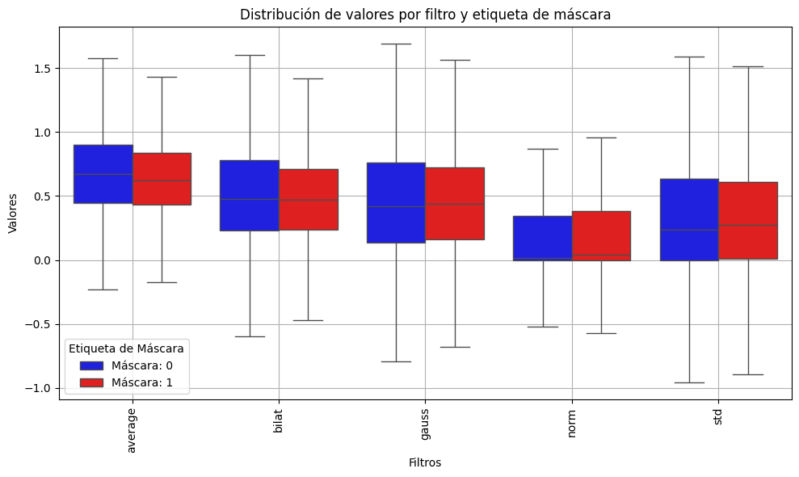
      <br>
      Imagen 11. ARCADE-Segmentación-Caja y bigotes
    </td>
    <td align="center">
      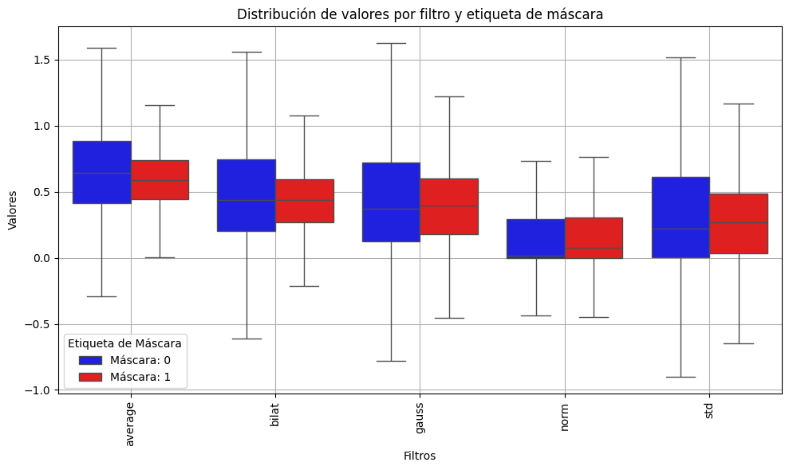
      <br>
      Imagen 12. ARCADE-Detección-Caja y bigotes
    </td>
  </tr>
</table>

## **SEGMENTACIÓN VASCULAR**

### Modelo U-Net

<table>
  <tr>
    <td align="center">
      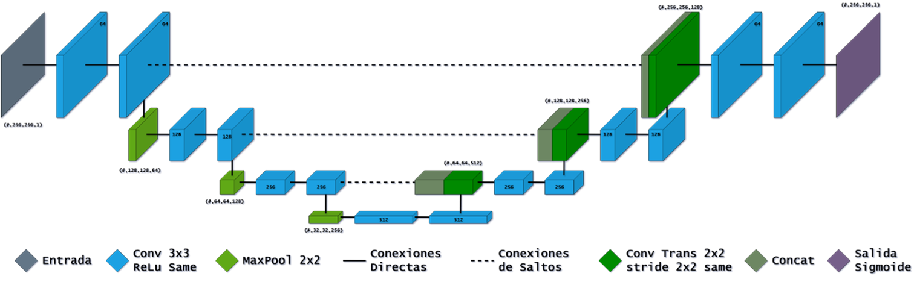
      <br>
      Imagen 13. Segmentación-UNet
    </td>
  </tr>
</table>

### Resultados: [Mejores pesos](checkpoints/segmentation/bw_p_dropout00_loss02_norm-bilateral.weights.h5)

Modelo U-Net sin Dropout y filtros $[32, 64, 128, 256]$, con un batch size de $8$, un learning rate de $1 \times 10^{-5}$, un número de épocas máximas de $100$, una función de pérdida igual a $0.6 \times Dice_{loss} + 0.4 \times FocalBCE_{loss}$, y como entrada la normalización de la imágen original en el primer canal con la aplicación del filtro bilateral en el segundo canal de imagen teniendo un tamaño de $(512, 512, 2)$.

<table>
  <tr>
    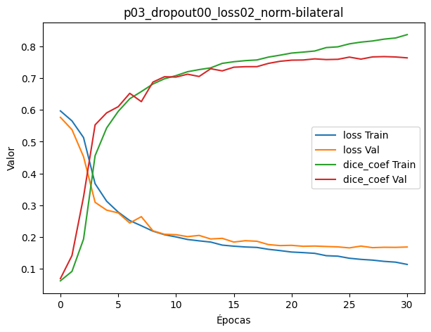
    <br>
    Imagen 14. Segmentación-UNet-Curvas de aprendizaje
  </tr>
  <tr>
    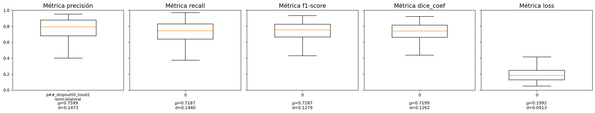
    <br>
    Imagen 15. Segmentación-UNet-Diagrama de caja y bigotes
  </tr>
  <tr>
    <td align="center">
      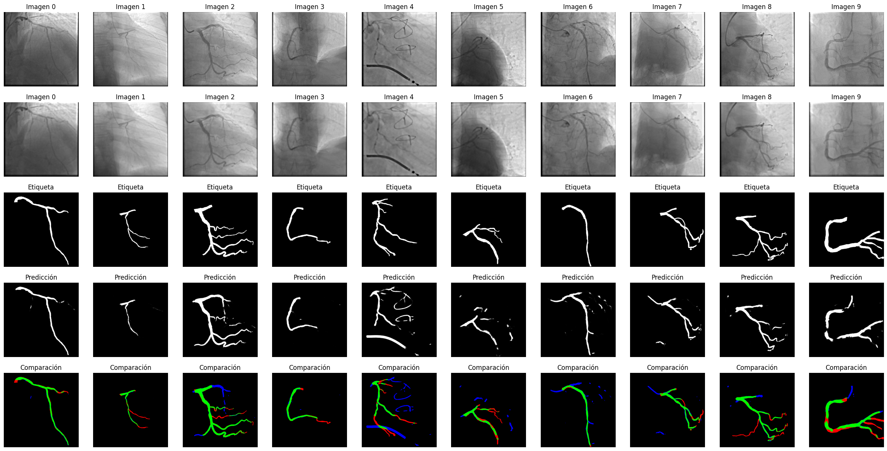
      <br>
      Imagen 16. Segmentación-UNet-Resultados 1
    </td>
    <td align="center">
      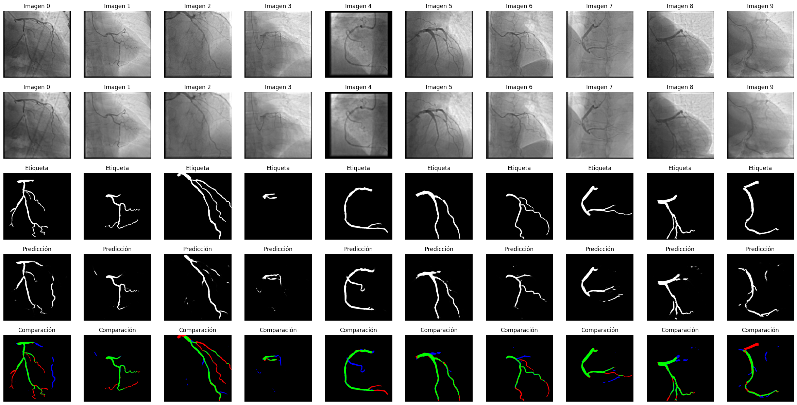
      <br>
      Imagen 17. Segmentación-UNet-Resultados 2
    </td>
  </tr>
</table>

## **DETECCIÓN DE ESTENOSIS**

### Modelo Res U-Net

<table>
  <tr>
    <td align="center">
      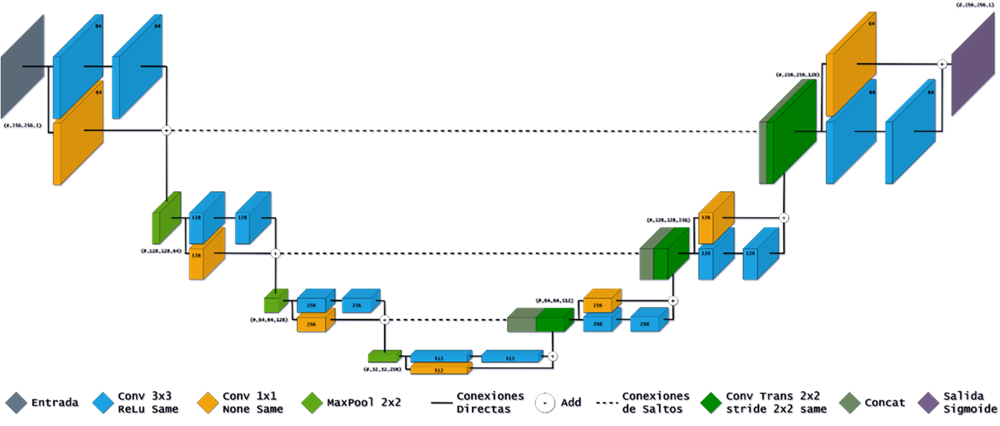
      <br>
      Imagen 18. Deteccion-Res UNet
    </td>
  </tr>
</table>


### Resultados: [Mejores pesos](checkpoints/detection/bw_p_dropout00_loss02_norm-gaussian.weights)

Modelo Res U-Net sin Dropout y filtros $[32, 64, 128, 256]$, con un batch size de $8$, un learning rate de $1 \times 10^{-5}$, un número de épocas máximas de $100$, una función de pérdida igual a $0.6 \times Dice_{loss} + 0.4 \times FocalBCE_{loss}$, y como entrada la normalización de la imágen original en el primer canal con la aplicación del desenfoque Gaussiano en el segundo canal de imagen teniendo un tamaño de $(512, 512, 2)$.

<table>
  <tr>
    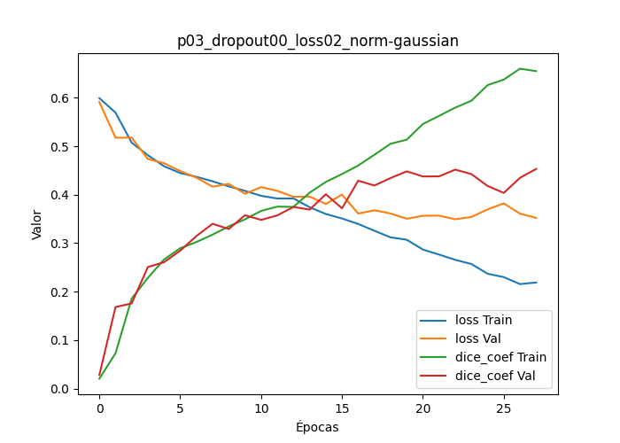
    <br>
    Imagen 19. Detección-Res UNet-Curvas de aprendizaje
  </tr>
  <tr>
    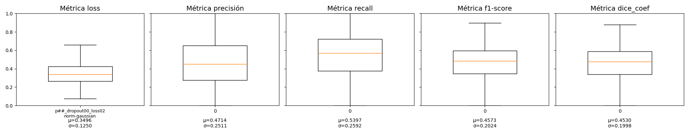
    <br>
    Imagen 20. Detección-Res UNet-Diagrama de caja y bigotes
  </tr>
  <tr>
    <td align="center">
      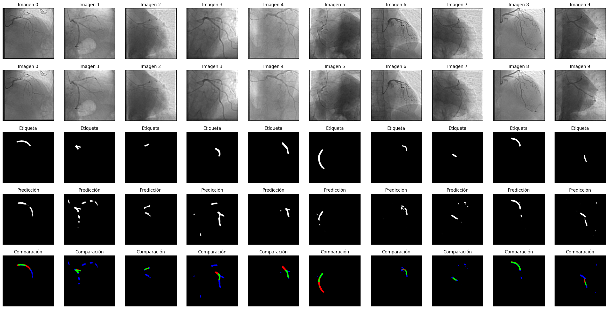
      <br>
      Imagen 21. Detección-Res UNet-Resultados 1
    </td>
    <td align="center">
      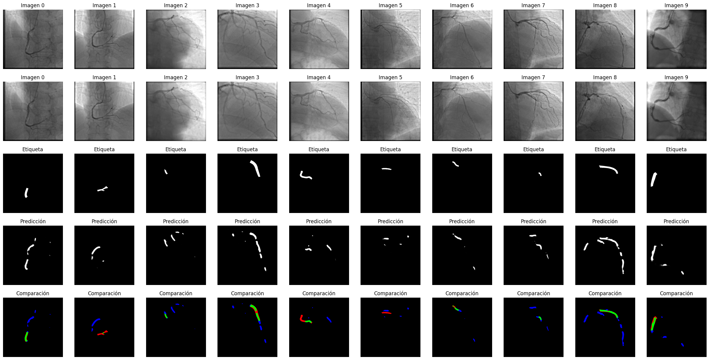
      <br>
      Imagen 22. Detección-Res UNet-Resultados 2
    </td>
  </tr>
</table>

